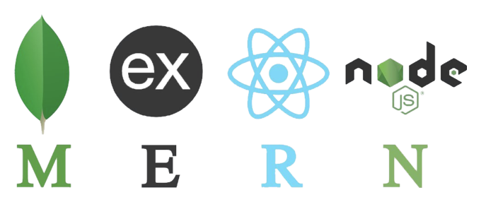

#  ***codeByPete*** | Portfolio 

>Please visit [codeByPete.com](https://www.codebypete.com) to join me, on ***myCodingJourney***.  

        

>*Mobile First* | *Responsive Design* | *CSS Animations*

 

## About
Thanks for visiting my portfolio. This repository is intended to showcase my progression as a Full Stack Web Developer, and includes projects developed during my self-taught journey and MIT xPro Coding Bootcamp.

## How to Run

This portfolio includes the following sections:
1. About Me
2. My Blog
3. Projects
4. Resume
5. Contact Form

## Future Roadmap
- [x] Refactor with Bootstrap
- [x] CSS Animations
- [x] Custom accordion functionality
- [x] Refactor footer & navbar with JavaScript
- [x] Add Scroll Magic effects
- [x] Refactor blog with JavaScript
- [x] Refactor projects cards with JavaScript

## MIT License

Copyright (c) 2022 Pete Chu  ***[codeByPete](https://www.codebypete.com)***

Permission is hereby granted, free of charge, to any person obtaining a copy of this software and associated documentation files (the "Software"), to deal in the Software without restriction, including without limitation the rights to use, copy, modify, merge, publish, distribute, sublicense, and/or sell copies of the Software, and to permit persons to whom the Software is furnished to do so, subject to the following conditions:

The above copyright notice and this permission notice shall be included in all copies or substantial portions of the Software.

THE SOFTWARE IS PROVIDED "AS IS", WITHOUT WARRANTY OF ANY KIND, EXPRESS OR IMPLIED, INCLUDING BUT NOT LIMITED TO THE WARRANTIES OF MERCHANTABILITY FITNESS FOR A PARTICULAR PURPOSE AND NONINFRINGEMENT. IN NO EVENT SHALL THE AUTHORS OR COPYRIGHT HOLDERS BE LIABLE FOR ANY CLAIM, DAMAGES OR OTHER LIABILITY, WHETHER IN AN ACTION OF CONTRACT, TORT OR OTHERWISE, ARISING FROM, OUT OF OR IN CONNECTION WITH THE SOFTWARE OR THE USE OR OTHER DEALINGS IN THE SOFTWARE.
